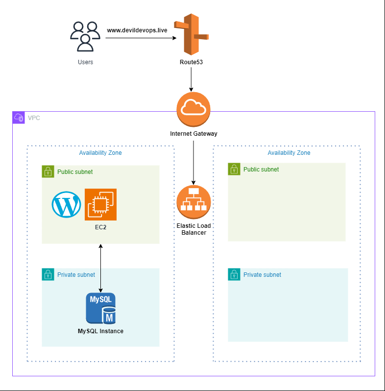
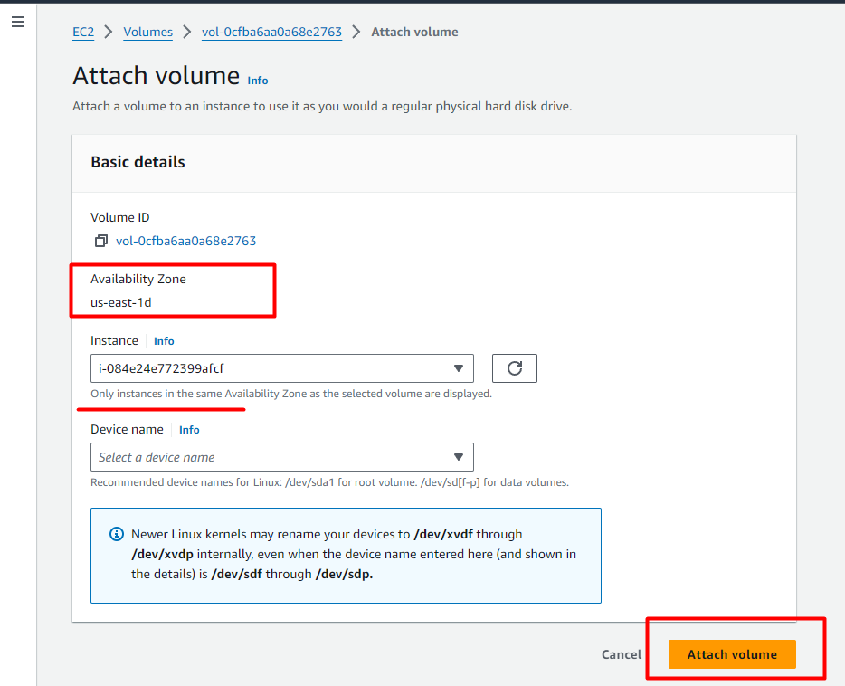

# Building a WordPress Web Solution with MySQL




This project outlines the process of deploying a scalable WordPress web solution on AWS with MySQL as the database, utilizing EC2, LVM for persistent storage, and Apache with PHP to run the web server.

## Table of Contents
- [Overview](#overview)
- [Architecture](#architecture)
- [Steps](#steps)
  - [Step 1: Prepare the Web Server](#step-1-prepare-the-web-server)
  - [Step 2: Install WordPress on the Web Server](#step-2-install-wordpress-on-the-web-server)
  - [Step 3: Install MySQL on the Database Server](#step-3-install-mysql-on-the-database-server)
  - [Step 4: Configure the Database](#step-4-configure-the-database)
  - [Step 5: Connect WordPress to the Database](#step-5-connect-wordpress-to-the-database)
- [Conclusion](#conclusion)

## Overview
This project involves setting up a WordPress website with a MySQL database hosted on separate EC2 instances. The web server is configured using LVM for data and log storage, while MySQL is installed on a separate instance to improve scalability and security. The entire infrastructure is designed for persistent storage, performance, and security.

## Architecture
The architecture diagram and reference files for this project can be found in the [GitHub repository](https://github.com/saurabhshende13/Building-a-WordPress-Web-Solution-with-MySQL.git).

## Steps

### Step 1: Prepare the Web Server
1. Launch an EC2 instance to serve as the **WordPress Web Server**.


2. Create three EBS volumes, each 10 GiB, in the same Availability Zone as your EC2 instance.



3. Open the Linux terminal to begin configuration.
   
4. Use `lsblk` to inspect the attached block devices.


6. Use `df -h` to view all mounts and free space on the server:
   ```bash
   df -h
   ```

8. Use `gdisk` to create a single partition on each disk:
   ```bash
   sudo gdisk /dev/xvdb
   sudo gdisk /dev/xvdc
   sudo gdisk /dev/xvdd
   ```

   Follow the on-screen prompts to create partitions. Choose options as needed and use:
   ```bash
    GPT fdisk (gdisk) version 1.0.3

    Partition table scan:
    MBR: not present
    BSD: not present
    APM: not present
    GPT: not present

    Creating new GPT entries.

    Command (? for help branch segun-edits: p
    Disk /dev/xvdf: 20971520 sectors, 10.0 GiB
    Sector size (logical/physical): 512/512 bytes
    Disk identifier (GUID): D936A35E-CE80-41A1-B87E-54D2044D160B
    Partition table holds up to 128 entries
    Main partition table begins at sector 2 and ends at sector 33
    First usable sector is 34, last usable sector is 20971486
    Partitions will be aligned on 2048-sector boundaries
    Total free space is 2014 sectors (1007.0 KiB)

    Number  Start (sector)    End (sector)  Size       Code  Name
     1            2048        20971486   10.0 GiB    8E00  Linux LVM

    Command (? for help): w

    Final checks complete. About to write GPT data. THIS WILL OVERWRITE EXISTING
    PARTITIONS!!

   Do you want to proceed? (Y/N): yes
   OK; writing new GUID partition table (GPT) to /dev/xvdf.
   The operation has completed successfully.
   Now,  your changes has been configured succesfuly, exit out of the gdisk console and do the same for the remaining disks.
   ```

9. Verify the newly configured partitions:
   ```bash
   lsblk
   ```

10. Install `lvm2` package and run `lvmdiskscan`:
   ```bash
   sudo yum install lvm2
   sudo lvmdiskscan
   ```

11. Mark each disk as a physical volume (PV):
   ```bash
   sudo pvcreate /dev/xvdb1
   sudo pvcreate /dev/xvdc1
   sudo pvcreate /dev/xvdd1
   ```

11. Verify PV creation:
   ```bash
   sudo pvs
   ```

11. Create a volume group (VG) named `webdata-vg`:
   ```bash
   sudo vgcreate webdata-vg /dev/xvdb1 /dev/xvdc1 /dev/xvdd1
   ```

12. Verify VG creation:
   ```bash
   sudo vgs
   ```

13. Create two logical volumes: `app-lv` and `logs-lv`:
   ```bash
   sudo lvcreate -n app-lv -L 14G webdata-vg
   sudo lvcreate -n logs-lv -L 14G webdata-vg
   ```

14. Verify Logical Volume creation:
   ```bash
   sudo lvs
   ```

15. Verify the entire setup:
   ```bash
   sudo vgdisplay -v
   sudo lsblk
   ```

16. Format the logical volumes with `mkfs.ext4`:
   ```bash
   sudo mkfs -t ext4 /dev/webdata-vg/app-lv
   sudo mkfs -t ext4 /dev/webdata-vg/logs-lv
   ```

17. Create directories for website and logs:
   ```bash
   sudo mkdir -p /var/www/html
   sudo mkdir -p /home/recovery/logs
   ```

18. Mount `/var/www/html` on the `apps-lv` logical volume:
   ```bash
   sudo mount /dev/webdata-vg/apps-lv /var/www/html/
   ```

19. Backup log files before mounting:
   ```bash
   sudo rsync -av /var/log/. /home/recovery/logs/
   ```

20. Mount `/var/log` on `logs-lv`:
   ```bash
   sudo mount /dev/webdata-vg/logs-lv /var/log
   ```

21. Restore log files to `/var/log`:
   ```bash
   sudo rsync -av /home/recovery/logs/. /var/log
   ```

22. Update the `/etc/fstab` file:
   ```bash
   sudo blkid
   sudo vi /etc/fstab
   ```

23. Test the configuration and reload the daemon:
   ```bash
   sudo mount -a
   sudo systemctl daemon-reload
   ```

24. Verify the setup:
   ```bash
   df -h
   ```

### Step 2: Install WordPress on the Web Server
1. Update the repository:
   ```bash
   sudo yum -y update
   ```

2. Install Apache, PHP, and dependencies:
   ```bash
   sudo yum -y install wget httpd php php-mysqlnd php-fpm php-json
   ```

3. Start and enable Apache:
   ```bash
   sudo systemctl enable httpd
   sudo systemctl start httpd
   ```

4. Install additional PHP dependencies:
   ```bash
   sudo yum install https://dl.fedoraproject.org/pub/epel/epel-release-latest-8.noarch.rpm
   sudo yum install yum-utils http://rpms.remirepo.net/enterprise/remi-release-8.rpm
   sudo yum module reset php
   sudo yum module enable php:remi-7.4
   sudo yum install php php-opcache php-gd php-curl php-mysqlnd
   sudo systemctl start php-fpm
   sudo systemctl enable php-fpm
   setsebool -P httpd_execmem 1
   ```

5. Restart Apache:
   ```bash
   sudo systemctl restart httpd
   ```

6. Download and set up WordPress:
   ```bash
   mkdir wordpress
   cd wordpress
   sudo wget http://wordpress.org/latest.tar.gz
   sudo tar xzvf latest.tar.gz
   sudo rm -rf latest.tar.gz
   cp wordpress/wp-config-sample.php wordpress/wp-config.php
   cp -R wordpress /var/www/html/
   ```

7. Configure SELinux policies:
   ```bash
   sudo chown -R apache:apache /var/www/html/wordpress
   sudo chcon -t httpd_sys_rw_content_t /var/www/html/wordpress -R
   sudo setsebool -P httpd_can_network_connect=1
   ```

### Step 3: Install MySQL on the Database Server
1. Update the repository and install MySQL:
   ```bash
   sudo yum update
   sudo yum install mysql-server
   ```

2. Ensure MySQL is running:
   ```bash
   sudo systemctl restart mysqld
   sudo systemctl enable mysqld
   ```

### Step 4: Configure the Database
1. Log in to MySQL and create the WordPress database:
   ```bash
   sudo mysql
   CREATE DATABASE wordpress;
   CREATE USER `myuser`@`<Web-Server-Private-IP-Address>` IDENTIFIED BY 'mypass';
   GRANT ALL ON wordpress.* TO 'myuser'@'<Web-Server-Private-IP-Address>';
   FLUSH PRIVILEGES;
   SHOW DATABASES;
   exit
   ```

### Step 5: Connect WordPress to the Database
1. Install the MySQL client on the web server:
   ```bash
   sudo yum install mysql
   sudo mysql -u admin -p -h <DB-Server-Private-IP-address>
   ```

2. Enable TCP port 80 in the Inbound Rules for the web server EC2 and access the WordPress setup in your browser.

---

## Conclusion
This guide provides detailed steps for deploying a WordPress web solution with MySQL using EC2 instances on AWS. The LVM configuration ensures efficient storage management for the application data and logs, while separating the database server enhances security.

--- 

You can now use this for your project!
